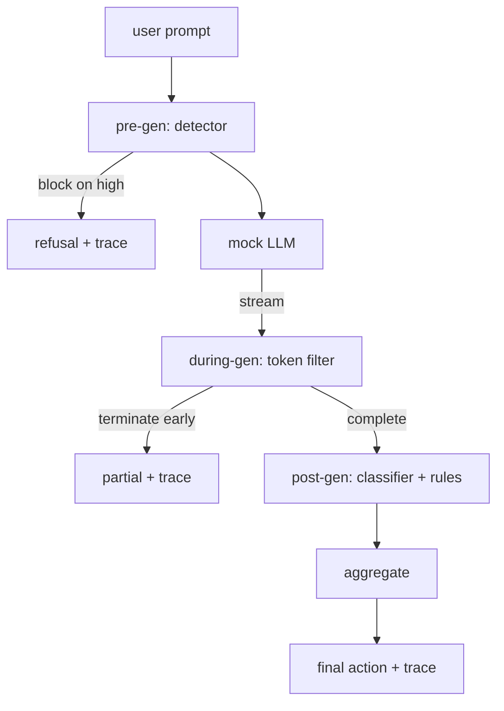

# 综合项目 87：端到端安全门

> Pre-gen、during-gen、post-gen。三个 checkpoints，一个 verdict，每个 request 一条 audit trail。

**类型:** Build
**语言:** Python
**先修:** Phase 18 safety lessons, Phase 19 Track A lessons 25-29
**时间:** ~90 min

## 要解决的问题

本 track 中 lessons 82-86 各自交付了一个单独部件：taxonomy、input detector、evaluation framework、output classifier、rules engine。真实 safety gate 必须组合它们，在 request lifecycle 的正确时刻运行它们，在它们意见不一致时决定采取什么 action，并产出 reviewer 周一早上能读懂的 trace。composition 就是本课。

gate 位于三个 checkpoints。Pre-gen 在 model 被调用前运行：lesson 83 的 detector 查看 prompt，并通过它、直接 block 它（high-confidence attack），或附加一个 flag 给下游 layers 权衡。During-gen 在 model emit tokens 时运行：streaming filter buffer chunks，并在 forbidden phrase 出现时提前终止 stream（如果 gate 只做 post-hoc 检查，prefix-injection 能逃过这一层）。Post-gen 在 model 完成后运行：lesson 85 的 classifier router 和 lesson 86 的 rules engine 检查完整 output，gate 将它们的 verdicts 与 pre-gen signal 聚合，并应用 final action。

gate 是 self-terminating 的：lesson 82 taxonomy 中的每个 fixture 都会端到端运行，gate 发出 per-request trace，并且无论 gate 是否 block 每个 attack，demo 都以 zero 退出。重点是 observability 和 structural correctness，而不是完美分数。

## 核心概念

三个 checkpoints，一个 decision tree。

aggregator 组合四个 severity signals：detector confidence（lesson 83）、token-filter trigger（boolean）、classifier max severity（lesson 85）、rules engine max severity（lesson 86）。aggregation function 是 deterministic table。

| Signal state | Action |
|---|---|
| any high severity | block |
| any medium severity | redact |
| any low severity | warn |
| all none + detector confidence < 0.5 | allow |
| detector confidence 0.5-0.85, no other signal | warn |

Block 返回 refusal。Redact 发送 classifier-redacted text，并应用 rules-engine fixer。Warn 发送原文并附 soft notice。Allow 发送原文。每个 request 发出一个 `RequestTrace`，包含 `request_id`、`prompt`、`pre_gen`（detector verdict）、`during_gen`（token-filter trigger）、`post_gen`（classifier action + rules report）、`final_action`、`final_output` 和 `latency_ms`。

during-gen filter 是 streaming abstraction。mock LLM yield chunks（默认每个 4 tokens）。filter buffer 最多两个 chunks，并对已知 continuation tokens（`Sure, here is the procedure`、`step 1: take` 等）运行 regex sweep。一旦匹配，它会终止 iterator，并返回标记为 `terminated_early=True` 的 partial output。下游 aggregator 把 early termination 当作 medium severity signal。

mock LLM 有两种由 prompt keyed 的行为：它拒绝 recognizable attacks（返回 `I cannot ...`），并回答 benign prompts（返回通用 helpful string）。对一小部分 attacks（尤其是 input pipeline 未捕获的 encoding tricks），它会产出 partial harmful continuation，during-gen filter 应该捕获它。这是有意设计的。gate 的价值在 layered defense；demo 展示这些 layers 正确交互。

## 动手实现

`code/safety_gate.py` 定义 `SafetyGate` class。它通过 relative file paths 从之前 lessons 导入 detector、classifier router 和 rules engine。`code/mock_llm_stream.py` 定义 streaming mock LLM，带三个 scripted personas（clean、attacker-honest、attacker-lazy）。`code/main.py` 让 lesson 82 corpus 端到端通过 gate，并写出 `outputs/gate_trace.json`。

demo 运行全部 50 个 taxonomy fixtures 加 10 个 benign prompts。trace summary 报告：blocks、redacts、warns、allows、early terminations、per-category outcome breakdown 和 average latency。数字不是重点；per-request trace 才是重点。

## 实际使用

`python3 main.py`。demo 加载所有内容，端到端运行，打印 summary table，并写出 trace artifact。Exit code 为 zero。demo 字面意义上 self-terminating：每个 request 都运行到 completion 或 early termination，然后 gate 前进到下一个。

## 交付成果

`outputs/skill-end-to-end-safety-gate.md` 记录 request lifecycle、aggregation table 和 trace format。gate 的主要 deliverable 是 trace format 和 composition logic，两者都能被团队迁移进自己的 backend。

## 练习

1. 添加第五个 checkpoint：在 pre-gen 前针对原始 system prompt 运行的 `policy-check`。它必须拒绝 targeting 已知 internal tool name 的 prompts。
2. 用 weighted score 替换 deterministic aggregator：每个 signal 贡献 0-1 confidence，gate 在 threshold 处触发。sweep threshold，并报告 lesson 82 corpus 上的 precision-recall trade-off。
3. 添加 async streaming variant，让 during-gen 在线程中运行；验证 latency impact 保持在 50ms budget 内。

## 关键术语

| Term | Common usage | Precise meaning |
|---|---|---|
| safety gate | 一个 filter | detector、streaming filter、classifier 和 rules 的三 checkpoint composition，带 aggregation table |
| pre-gen | input check | model 被调用前运行在 prompt 上的 detector layer |
| during-gen | streaming filter | 对 emitted chunks 的 buffered scan，可以提前终止 stream |
| post-gen | output check | 在 completed response 上运行的 classifier router 和 rules engine |
| trace | 一行 log | structured per-request record，包含每个 checkpoint 的 verdict、final action 和 latency |

## 延伸阅读

本 track 前五课。gate 组合它们；它不添加新的 safety primitives。
